# 🛒 E-Commerce REST API

A production-ready, scalable e-commerce REST API built with ASP.NET Core 8.0, featuring JWT authentication, Stripe payment integration, and comprehensive order management capabilities.


## 🎯 Overview

This e-commerce API serves as a robust backend solution for online retail platforms, handling everything from user authentication to payment processing. Built with enterprise-grade patterns and best practices, it demonstrates proficiency in modern .NET development, RESTful API design, and secure payment integration.

**Live Demo:** https://ecommerceapi-i9u5.onrender.com/ 
**API Documentation:** Available via Swagger UI at `/swagger`

## ✨ Key Features

### Core Functionality
- **Authentication & Authorization**
  - JWT-based authentication with refresh token support
  - Role-based access control (RBAC) for admin operations
  - Secure password hashing using BCrypt
  - Token expiration and validation

- **Product Management**
  - Full CRUD operations with admin privileges
  - Advanced search with multiple filters (name, category, price range)
  - Pagination for optimized data retrieval
  - Soft delete implementation for data integrity
  - Real-time inventory tracking

- **Shopping Cart**
  - Persistent cart across sessions
  - Real-time stock validation
  - Automatic cart total calculation
  - Concurrent update handling

- **Order Processing**
  - Secure checkout flow with Stripe integration
  - Order status tracking (Pending → Processing → Shipped → Delivered)
  - Order history and detailed receipts
  - Admin order management dashboard
  - Automatic stock adjustment on purchase

### Technical Highlights
- **RESTful Design**: Follows REST principles with proper HTTP methods and status codes
- **Entity Framework Core**: Code-first approach with migrations
- **Dependency Injection**: Loosely coupled, testable architecture
- **Error Handling**: Comprehensive exception handling with meaningful error responses
- **API Versioning**: Ready for future version management
- **CORS Configuration**: Flexible cross-origin resource sharing
- **Swagger Integration**: Auto-generated, interactive API documentation

## 🏗️ Architecture

```
┌─────────────────────────────────────────────────────────────┐
│                         Client Layer                         │
│                  (Web, Mobile, Desktop)                      │
└────────────────────────┬────────────────────────────────────┘
                         │
                         ▼
┌─────────────────────────────────────────────────────────────┐
│                      API Gateway Layer                       │
│              (Authentication, Rate Limiting)                 │
└────────────────────────┬────────────────────────────────────┘
                         │
                         ▼
┌─────────────────────────────────────────────────────────────┐
│                     Controller Layer                         │
│        (AuthController, ProductsController, etc.)            │
└────────────────────────┬────────────────────────────────────┘
                         │
                         ▼
┌─────────────────────────────────────────────────────────────┐
│                      Business Logic                          │
│              (Validation, Business Rules)                    │
└────────────────────────┬────────────────────────────────────┘
                         │
                         ▼
┌─────────────────────────────────────────────────────────────┐
│                     Data Access Layer                        │
│              (Entity Framework Core, DbContext)              │
└────────────────────────┬────────────────────────────────────┘
                         │
                         ▼
┌─────────────────────────────────────────────────────────────┐
│                      Database Layer                          │
│                    (SQL Server)                              │
└─────────────────────────────────────────────────────────────┘
```

## 🛠️ Tech Stack

### Backend
- **Framework**: ASP.NET Core 8.0
- **Language**: C# 11.0
- **ORM**: Entity Framework Core 8.0
- **Database**: SQL Server 2022
- **Authentication**: JWT (JSON Web Tokens)
- **Password Hashing**: BCrypt.Net

### Third-Party Integrations
- **API Documentation**: Swashbuckle (Swagger/OpenAPI 3.0)

### Development Tools
- **IDE**: Visual Studio 2022 / VS Code
- **Version Control**: Git
- **Package Manager**: NuGet
- **API Testing**: Postman, Swagger UI


### Product Endpoints

#### Get Products (with filtering)
```http
GET /api/products?search=laptop&category=Electronics&minPrice=500&maxPrice=2000&page=1&pageSize=10
```

**Query Parameters:**
| Parameter | Type | Description |
|-----------|------|-------------|
| search | string | Search in product name/description |
| category | string | Filter by category |
| minPrice | decimal | Minimum price filter |
| maxPrice | decimal | Maximum price filter |
| page | integer | Page number (default: 1) |
| pageSize | integer | Items per page (default: 10) |

**Response: 200 OK**
```json
{
  "data": [
    {
      "id": 1,
      "name": "Gaming Laptop",
      "description": "High-performance gaming laptop",
      "price": 1299.99,
      "stockQuantity": 15,
      "category": "Electronics",
      "isActive": true
    }
  ],
  "pagination": {
    "totalCount": 45,
    "page": 1,
    "pageSize": 10,
    "totalPages": 5
  }
}
```

#### Create Product (Admin Only)
```http
POST /api/products
Authorization: Bearer {admin_token}
Content-Type: application/json

{
  "name": "Wireless Mouse",
  "description": "Ergonomic wireless mouse with USB receiver",
  "price": 29.99,
  "stockQuantity": 100,
  "category": "Electronics",
}
```

### Cart Endpoints

#### Get User Cart
```http
GET /api/cart
Authorization: Bearer {token}
```

**Response: 200 OK**
```json
{
  "id": 1,
  "items": [
    {
      "id": 1,
      "product": {
        "id": 1,
        "name": "Gaming Laptop",
        "price": 1299.99
      },
      "quantity": 1,
      "subtotal": 1299.99
    }
  ],
  "totalAmount": 1299.99
}
```

#### Add Item to Cart
```http
POST /api/cart/items
Authorization: Bearer {token}
Content-Type: application/json

{
  "productId": 1,
  "quantity": 2
}
```

### Order Endpoints

#### Checkout
```http
POST /api/orders/checkout
Authorization: Bearer {token}
Content-Type: application/json

{
  "shippingAddress": "123 Main St, New York, NY 10001",
  "paymentMethodId": "pm_card_visa"
}
```

**Response: 201 Created**
```json
{
  "id": 1,
  "totalAmount": 1299.99,
  "status": "Processing",
  "shippingAddress": "123 Main St, New York, NY 10001",
  "createdAt": "2024-01-15T10:30:00Z",
  "items": [
    {
      "id": 1,
      "product": {
        "id": 1,
        "name": "Gaming Laptop"
      },
      "quantity": 1,
      "priceAtPurchase": 1299.99,
      "subtotal": 1299.99
    }
  ]
}
```

#### Get User Orders
```http
GET /api/orders
Authorization: Bearer {token}
```

#### Update Order Status (Admin Only)
```http
PUT /api/orders/{id}/status
Authorization: Bearer {admin_token}
Content-Type: application/json

"Shipped"
```

### Error Responses

The API uses conventional HTTP response codes:

| Code | Description |
|------|-------------|
| 200 | Success |
| 201 | Created |
| 204 | No Content |
| 400 | Bad Request - Invalid input |
| 401 | Unauthorized - Invalid or missing token |
| 403 | Forbidden - Insufficient permissions |
| 404 | Not Found |
| 500 | Internal Server Error |

**Example Error Response:**
```json
{
  "message": "Product not found",
  "statusCode": 404,
  "timestamp": "2024-01-15T10:30:00Z"
}
```

## 🚀 Getting Started

### Prerequisites

- [.NET 8.0 SDK](https://dotnet.microsoft.com/download/dotnet/8.0)
- [SQL Server 2022](https://www.microsoft.com/en-us/sql-server/sql-server-downloads) or LocalDB
- [Visual Studio 2022](https://visualstudio.microsoft.com/) (recommended) or VS Code
- [Git](https://git-scm.com/downloads)

### Installation

1. **Clone the repository**
   ```bash
   git clone https://github.com/dev-k99/ECommerceAPI
   cd ecommerce-api
   ```

2. **Restore dependencies**
   ```bash
   dotnet restore
   ```

3. **Update database connection string**
   
   Edit `appsettings.json`:
   ```json
   "ConnectionStrings": {
     "DefaultConnection": "Server=(localdb)\\mssqllocaldb;Database=ECommerceDB;Trusted_Connection=true;MultipleActiveResultSets=true"
   }
   ```

4. **Configure Stripe API keys** (Optional for testing)
   
   Get your keys from [Stripe Dashboard](https://dashboard.stripe.com/test/apikeys):
   ```json
   "Stripe": {
     "PublishableKey": "pk_test_YOUR_KEY",
     "SecretKey": "sk_test_YOUR_KEY"
   }
   ```

5. **Run database migrations**
   ```bash
   dotnet ef database update
   ```

6. **Run the application**
   ```bash
   dotnet run
   ```

7. **Access Swagger UI**
   
   Navigate to `https://localhost:7001` in your browser

### Default Admin Credentials

```
Email: admin@ecommerce.com
Password: Admin123!
```

## 💾 Database Schema

```mermaid
erDiagram
    Users ||--o{ Orders : places
    Users ||--|| Carts : has
    Carts ||--o{ CartItems : contains
    Products ||--o{ CartItems : "included in"
    Products ||--o{ OrderItems : "included in"
    Orders ||--o{ OrderItems : contains

    Users {
        int Id PK
        string Email UK
        string PasswordHash
        string FirstName
        string LastName
        bool IsAdmin
        datetime CreatedAt
    }

    Products {
        int Id PK
        string Name
        string Description
        decimal Price
        int StockQuantity
        string Category
        string ImageUrl
        bool IsActive
        datetime CreatedAt
        datetime UpdatedAt
    }

    Carts {
        int Id PK
        int UserId FK
        datetime CreatedAt
        datetime UpdatedAt
    }

    CartItems {
        int Id PK
        int CartId FK
        int ProductId FK
        int Quantity
        datetime AddedAt
    }

    Orders {
        int Id PK
        int UserId FK
        decimal TotalAmount
        string Status
        string PaymentIntentId
        string ShippingAddress
        datetime CreatedAt
        datetime UpdatedAt
    }

    OrderItems {
        int Id PK
        int OrderId FK
        int ProductId FK
        int Quantity
        decimal PriceAtPurchase
    }
```



### Database Relationships

- **One-to-Many**: User → Orders (A user can have multiple orders)
- **One-to-One**: User ↔ Cart (Each user has one cart)
- **One-to-Many**: Cart → CartItems (A cart can have multiple items)
- **Many-to-One**: CartItems → Product (Multiple cart items can reference the same product)
- **One-to-Many**: Order → OrderItems (An order contains multiple items)
- **Many-to-One**: OrderItems → Product (Multiple order items can reference the same product)

## 🔒 Security

### Authentication
- **JWT Tokens**: Stateless authentication with 7-day expiration
- **Password Security**: BCrypt hashing with salt rounds
- **Token Validation**: Automatic validation on protected endpoints

### Authorization
- **Role-Based Access Control (RBAC)**
  - `User` role: Cart, orders, profile management
  - `Admin` role: Product CRUD, all order management, inventory control

### Best Practices Implemented
- ✅ Input validation on all endpoints
- ✅ SQL injection prevention (EF Core parameterized queries)
- ✅ XSS protection through proper encoding
- ✅ CORS configuration for controlled access
- ✅ HTTPS enforcement in production
- ✅ Sensitive data excluded from logs
- ✅ Rate limiting ready (can be implemented)


## ⚡ Performance

### Optimization Techniques

1. **Database Indexing**
   - Indexed on frequently queried fields (Email, ProductName, Category)
   - Composite indexes for multi-column queries

2. **Pagination**
   - Implements skip/take pattern for large datasets
   - Reduces memory footprint and response time

3. **Eager Loading**
   - Uses `.Include()` to prevent N+1 query problems
   - Optimizes related data retrieval

4. **Caching Strategy** (Future Enhancement)
   - Redis for session management
   - Memory cache for frequently accessed products

5. **Async/Await**
   - All database operations are asynchronous
   - Improves scalability and throughput

## 🤝 Contributing

Contributions are welcome! Please follow these steps:

1. Fork the repository
2. Create a feature branch (`git checkout -b feature/AmazingFeature`)
3. Commit your changes (`git commit -m 'Add some AmazingFeature'`)
4. Push to the branch (`git push origin feature/AmazingFeature`)
5. Open a Pull Request

### Coding Standards
- Follow C# naming conventions
- Write XML documentation for public APIs
- Maintain test coverage above 80%
- Update README for new features

## 📄 License

This project is licensed under the MIT License - see the [LICENSE](LICENSE) file for details.

## 👨‍💻 Author

**Your Name**
- Portfolio: [yourportfolio.com](https://yourportfolio.com)
- LinkedIn: [linkedin.com/in/yourprofile](https://linkedin.com/in/yourprofile)
- Email: your.email@example.com
- GitHub: [@yourusername](https://github.com/yourusername)

## 🙏 Acknowledgments

- [ASP.NET Core Documentation](https://docs.microsoft.com/aspnet/core)
- [Entity Framework Core](https://docs.microsoft.com/ef/core)
- [Stripe API](https://stripe.com/docs/api)
- [JWT.io](https://jwt.io/)
- [Roadmap.sh](https://roadmap.sh) for project inspiration

## 📞 Support

For support, email your.email@example.com or open an issue in the repository.

---

⭐ If you found this project helpful, please give it a star!

**Built with ❤️ using ASP.NET Core**